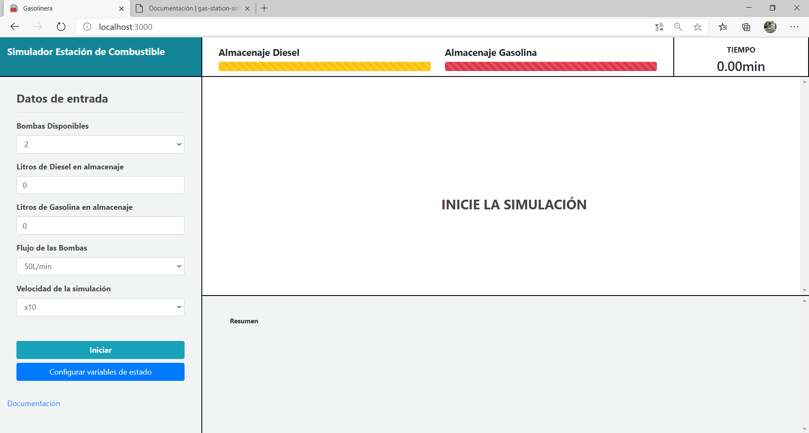
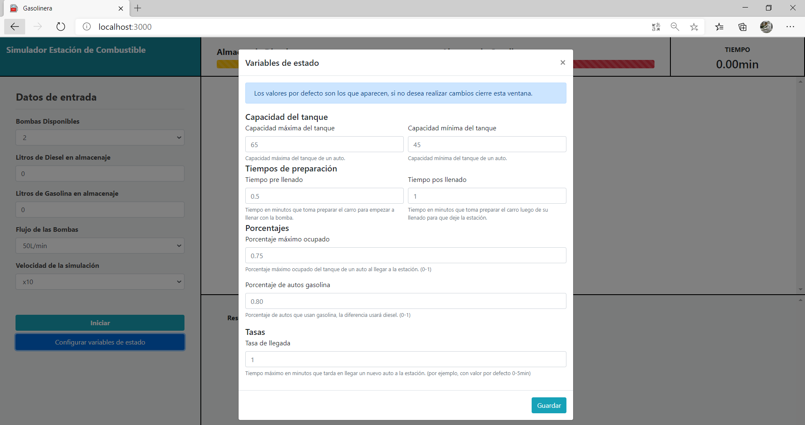
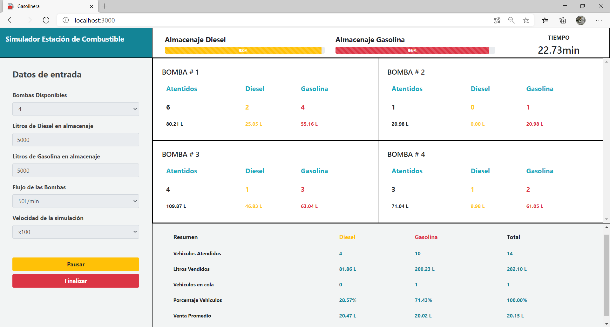

## Documentación

Aquí podrás encontrar lo necesario para poder entender el funcionamiento de este proyecto desde la instalación hasta su uso. Sigue leyendo para poder comprenderlo todo.

## Contenido 📘 

1. [Prerrequisitos](#prerequisitos)
   - [Requisitos del sistema](#requisitos-del-sistema)
   - [Clonando el repositorio](#clonando-el-repositorio)
   - [Instalando los paquetes necesarios](#instalando-los-paquetes-necesarios)
   - [Ejecutando el proyecto](#ejecutando-el-proyecto)
2. [Manual técnico](#manual-técnico)
   - [Herramientas utilizadas](#herramientas-utilizadas)
   - [Interacción cliente-servidor](#interacción-cliente-servidor)
3. [Manual de usuario](#manual-de-usuario)
   - [Iniciando el servidor de Node](#iniciando-el-servidor-de-node)
   - [Ingresando al simulador](#ingresando-al-simulador)
   - [Datos de entrada](#datos-de-entrada)
   - [Configurar variables de estado](#configurar-variables-de-estado)
   - [Iniciando la simulación](#iniciando-la-simulación)
   - [Salidas de la simulación](#salidas-de-la-simulación)

## Prerequisitos

Aquí podrás ver todo lo referente a las instrucciones necesarias para clonar y ejecutar este proyecto en tu computadora.

### Requisitos del sistema

Esto es todo lo que necesitas para poder usar este simulador en tu equipo.

| _Software_ | Versión mínima |
| ---------- | -------------- |
| Node.js    | 12.x           |
| npm        | 6.x            |

Puedes descargar Node.js [aquí](https://nodejs.org/en/).

### Clonando el repositorio

Este repositorio está alojado en Github, hay dos maneras disponibles para clonarlo.

#### Cliente de escritorio

Github ofrece un programa para escritorio y puedes descárgarlo [aquí](https://desktop.github.com/). Una vez lo tengas instalado puedes clonarlo haciendo referencia al repositorio por medio de este enlace:

```
https://github.com/fabricioism/gas-station-simulation.git
```

#### Vía terminal de comandos

Esto lo puedes hacer mediante Git, lo puedes descargar [aquí](https://git-scm.com/).

Pasos:

1. Abre la terminal.
2. Muévete al directorio donde deseas clonar el repositorio.
3. Pega y ejecuta en la terminal el siguiente comando:

```
git clone https://github.com/fabricioism/gas-station-simulation.git
```

Una vez hayas clonado el repositorio tendrás una nueva carpeta con el nombre del repositorio, este contiene en su interior el código fuente del simulador.

### Instalando los paquetes necesarios

Con tu editor de texto favorito ([VSC](https://code.visualstudio.com/), [_Sublime text_](https://www.sublimetext.com/)) abre la carpeta donde clonaste el proyecto y posteriormente abre la terminal. Hecho lo anterior ejecuta el siguiente comando:

```
npm install
```

Esto instalará todos los paquetes necesarios para ejecutar el proyecto.

### Ejecutando el proyecto

Ya todo está listo para la ejecución del simulador. En la terminal ejecuta el siguiente comando:

```
node server.js
```

Con el comando anterior el servidor local inicia su ejecución y en el puerto `3000` se ejecuta el simulador. Abre tu navegador y en la barra de direcciones copia la siguiente URL: `http://localhost:3000/`

Se cargará el simulador y desde ese momento ya podrás hacer uso de el.

## Manual técnico

### Herramientas utilizadas

1. Javascript (cliente y servidor)
2. HTML (cliente)
3. CSS (cliente)
4. Bootstrap (cliente) leer más [aquí](https://getbootstrap.com/).
5. Socket<span>.I</span>O (comunicación cliente-servidor) leer más [aquí](https://socket.io/).
6. Hypertimer (simulación del tiempo) leer más [aquí](https://www.npmjs.com/package/hypertimer).

### Interacción cliente-servidor

La interacción cliente-servidor se genera de múltiples maneras, como puede ser la obtención de los datos iniciales, cambio de variables de estado, inicio, pausa, continuar, finalizar y las actualizaciones que debe recibir el cliente. En los siguientes esquemas se detalla de forma visual de estas interacciones.

#### Variables de estado


Al cargar el cliente del simulador y acceder a la URL `http://localhost:3000/` el cliente enviará una solicitud para obtener las variables de estado (según el último valor que se almaceno). El servidor devolverá las variables de estado que estaban almacenadas.


Previo a iniciar la simulación el usuario puede elegir modificar las variables de estado (capacidad máxima y mínima del tanque de un auto, tiempo que toma preparar el auto previo y pos llenado, porcentaje máximo del tanque que puede traer ocupado un auto, porcentaje de autos que usan gasolina como combustible y la tasa de llegada a la estación). El servidor devolverá una respuesta exitosa luego de verificar que los valores ingresados se encuentren en los rangos correctos, de lo contrario enviará una respuesta no exitosa.

#### Iniciar la simulación


Al iniciar la simulación se envían los datos de entrada al servidor para proceder a inicializar la simulación. El servidor devolverá una respuesta al cliente que será exitosa si se logró iniciar la simulación sin problema, en caso de que ya exista un cliente simulando no se podrá iniciar y se enviara una respuesta no exitosa al cliente.

#### Durante la simulación


El usuario puede pausar la simulación en cualquier momento, cuando decide hacerlo se envía la solicitud de pausa al servidor, el servidor devolverá una respuesta exitosa en caso de que la simulación se esté ejecutando y aun no haya finalizado, caso contrario devolverá una respuesta no exitosa.


Luego de haber pausado una simulación el usuario puede elegir continuar con ella, en este caso se enviará una solicitud de continuar al servidor, el servidor devolverá una respuesta exitosa en caso de que la simulación este pausada y aun no haya finalizado, caso contrario devolverá una respuesta no exitosa.


El servidor se encarga de enviar actualizaciones al cliente al suceso de dos eventos, los cuales son:

1. Ingreso de un vehículo a la estación.
2. Un vehículo sale de la estación luego de ser atendido o si no hay combustible del tipo que solicitaba.

La actualización contiene la información necesaria para mostrar los niveles de almacenaje de cada tipo de combustible, los datos a mostrar de cada bomba de la estación, el resumen de toda la estación y además un estado de finalizado en caso de que la estación se quede sin combustible. En caso de que la estación se quede sin combustible para suplir la simulación se detendrá.


El usuario es capaz de finalizar una simulación que se esté ejecutando luego de haberla iniciado y sin importar si esta pausada o no, se envía la solicitud al servidor para finalizar la simulación, el servidor finaliza todo en caso de que haya una simulación iniciada y envía una respuesta de éxito, caso contrario se envía una respuesta no exitosa.

## Manual de usuario

### Iniciando el servidor de Node

Este simulador es una aplicación web asi que requiere de un servidor que provea del alojamiento del sitio. Además es necesario para realizar todas las operaciones.

Con tu editor de texto favorito (En nuestro caso [VSC](https://code.visualstudio.com/)) abre en tu espacio de trabajo la ubicación del simulador que previamente clonaste. Copia y pega el siguiente comando en la terminal:

```
node server.js
```


Hecho lo anterior el servidor inicia su ejecución y por medio del puerto `3000`.

### Ingresando al simulador

Dado que este es un simulador que se ejecuta en una aplicación web basta con abrir tu navegador para poder usarlo.

Abre una pestaña, copia y pega la siguiente URL: `http://localhost:3000/`


Cargando lo siguiente:


### Datos de entrada

Este simulador requiere que se provean de ciertos datos de entrada que son usados dentro en la simulación. A continuación describimos estos campos.

| Dato de entrada                  | Descripción                                                                                                                                                                       |
| -------------------------------- | --------------------------------------------------------------------------------------------------------------------------------------------------------------------------------- |
| Bombas disponibles               | Número de bombas de servicio disponibles para su uso por los clientes                                                                                                             |
| Litros de diesel en almacenaje   | Cantidad en litros de diesel disponibles para vender                                                                                                                              |
| Litros de gasolina en almacenaje | Cantidad en litros de gasolina disponibles para vender                                                                                                                            |
| Flujo de las bombas              | Caudal de combustible que puede proveer una bomba a un auto                                                                                                                       |
| Velocidad de la simulación       | Este número multiplica nuestra unidad de tiempo por el que selecciones. Por ejemplo: Si escogió `x10` al transcurrir un minuto este equivale a 10 minutos dentro de la simulación |

### Configurar variables de estado

Debajo del cuadro de ingreso de datos puedes presionar en `Configurar variables de estado`




En esta ventana emergente puedes cambiar las variables de estado que inciden en la simulación. A continuación su detalle:

| Variable                     | Detalle                                                                                                                                                                                                                                                                                                                                                                                                       |
| ---------------------------- | ------------------------------------------------------------------------------------------------------------------------------------------------------------------------------------------------------------------------------------------------------------------------------------------------------------------------------------------------------------------------------------------------------------- |
| Capacidad máxima del tanque  | El valor máximo de capacidad en litros que pueden tener los tanques de los autos                                                                                                                                                                                                                                                                                                                              |
| Capacidad mínima del tanque  | El valor mínimo de combustible en litros que pueden tener los tanques de los autos                                                                                                                                                                                                                                                                                                                            |
| Tiempo pre-llenado           | Cantidad en minutos que puede tardar un auto desde su llegada a la estación hasta empezar a llenarse de combustible                                                                                                                                                                                                                                                                                           |
| Tiempo pos-llenado           | Cantidad en minutos que puede tardar un auto desde que fue llenado hasta irse de la estación                                                                                                                                                                                                                                                                                                                  |
| Porcentaje máximo ocupado    | Este número representa el porcentaje máximo ocupado del tanque de combustible que pueden tener los autos. Este debe estar en el intervalo `[0,1]`. Por ejemplo, `0.75` significa que todo auto que llegue a la estación tiene a lo más un `75%` de su tanque lleno                                                                                                                                            |
| Porcentaje de autos gasolina | Este número representa el porcentaje de autos tipo gasolina que existe en el parque vehicular y puede llegar a la estación. Este valor está en el intervalo de `[0,1]`. Por ejemplo, `0.80` significa que el `80%` del parque vehicular consume `Gasolina`. (El porcentaje de autos tipo diesel se encuentra de la diferencia de porcentaje entre autos tipo gasolina. En este ejemplo sería `0.2`, el `20%`) |
| Tasa de llegada              | Tiempo en minutos al que llegan nuevos autos a la estación. Por ejemplo, `5` representa que en intervalo de `(0-5) minutos` siempre llega un nuevo auto a la estación                                                                                                                                                                                                                                         |

Guarda esta configuración y todas las simulaciones que hagas tomarán en cuenta esas variables de estado. Si las quieres cambiar nuevamente repite el proceso anterior.

### Iniciando la simulación

Habiendo hecho lo anterior estamos listos para empezar a simular. Haz clic en el boton `Iniciar` que se encuentra en la parte inferior izquierda.


En ese momento la simulación comenzará.


La simulación finalizará una vez la finalices haciendo clic en el boton `Finalizar` o los niveles de combustible lleguen a cero. Asimismo puedes parar la simulación y continuar cuando quieras.

### Salidas de la simulación

Junto a la entrada de datos puedes ver un _dashboard_ en donde se muestran varios datos. A continuación su descripción:

#### Bombas

Aquí podrás ver un cuadro con datos por cada bomba que exista en la simulación. Esos datos representan lo siguiente:

| Atendidos | Diesel | Gasolina | Descripción                                                                                                                   |
| --------- | ------ | -------- | ----------------------------------------------------------------------------------------------------------------------------- |
| x + y     | x      | y        | Cantidad de autos ya atendidos durante la simulación por tipo de combustible. El primer valor es la suma de las dos restantes |
| w + z     | w      | z        | Cantidad de litros vendidas durante la simulación por tipo de combustible. El primer valor es la suma de las dos restantes    |

#### Resumen

En este podrás encontrar un resumen de los datos que se muestran para las bombas, además otros que se pueden inferir de los datos de salida existentes, a continuación su descripción:

|                      | Diesel | Gasolina | Total | Descripción                                                                 |
| -------------------- | ------ | -------- | ----- | --------------------------------------------------------------------------- |
| Vehículos atendidos  | n      | m        | n + m | Cantidad de autos atendidos durante la simulación                           |
| Litros vendidos      | p      | q        | p + q | Cantidad de litros vendidos de combustible                                  |
| Vehículos en cola    | r      | s        | r + s | Cantidad de autos pendientes por recibir el servicio                        |
| Porcentaje vehículos | t      | u        | t + u | Porcentaje de autos atendidos durante la simulación por tipo de combustible |
| Venta promedio       | v      | w        | y     | Venta promedio en litros de combustible por tipo durante la simulación      |

### Equipo de desarrollo

- **Fabricio Murilo** - [fabricioism](https://github.com/fabricioism)
- **Josue Silva** - [JosueSilvaA](https://github.com/JosueSilvaA)
- **Nelson Díaz** - [NnDz23](https://github.com/NnDz23)
